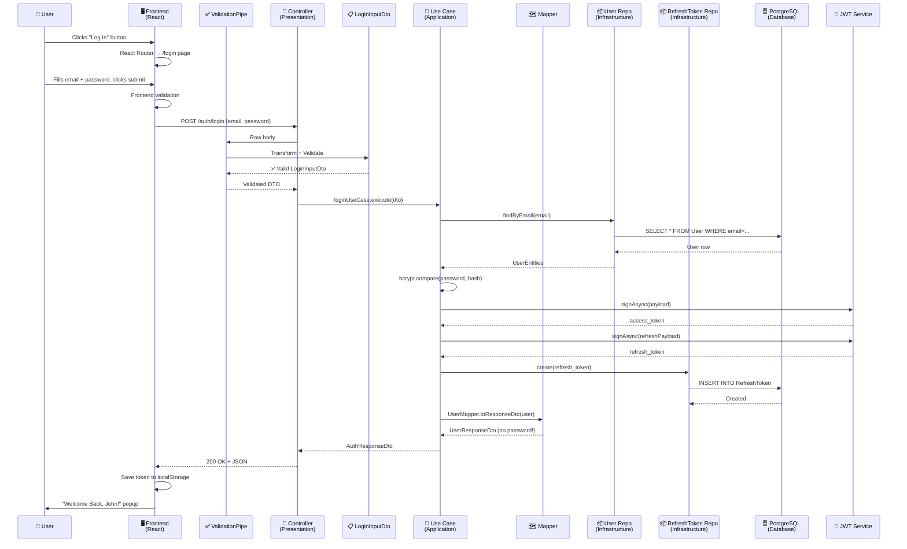

# 🔐 The Complete Login Flow — Step by Step

> A beginner-friendly walkthrough of what happens when you click **"Log In"** in Gigly, explained through every layer of the Clean Architecture.

---

## 🏗️ The Big Picture — Clean Architecture in 30 Seconds

Before we dive in, here's the **mental model**. Think of your backend like a building with 4 floors:

```
┌──────────────────────────────────────────────────────┐
│  🖥️  FRONTEND (React)                                │  ← The user sees this
├──────────────────────────────────────────────────────┤
│  🚪  PRESENTATION LAYER (Controllers, DTOs)          │  ← The "front door" of backend
├──────────────────────────────────────────────────────┤
│  🧠  APPLICATION LAYER (Use Cases, Mappers)          │  ← The "brain" / business logic
├──────────────────────────────────────────────────────┤
│  💎  DOMAIN LAYER (Entities, Interfaces)             │  ← The "rules" / pure definitions
├──────────────────────────────────────────────────────┤
│  🔧  INFRASTRUCTURE LAYER (DB, Email, Logger)        │  ← The "plumbing" / real-world stuff
└──────────────────────────────────────────────────────┘
```

**The golden rule**: Each layer only talks to the layer directly below it. The domain layer doesn't know about databases. The application layer doesn't know about HTTP. This keeps everything modular and testable.

---

## Step 1: 👆 User Clicks "Log In" Button

**File**: [`Navbar.tsx`](file:///home/l44lu/Dev/projects/giglyInnnnn/frontend/src/components/Navbar.tsx#L37-L41)

```tsx
<Link to="/login">
  <Button variant="outline" className="font-medium px-6 hidden sm:flex">
    Log In
  </Button>
</Link>
```

**What happens**: The `<Link to="/login">` is from React Router. When you click the button, it **doesn't reload the page** — instead, React Router changes the browser URL to `/login` and swaps out the page component. This is called **client-side routing**.

> [!TIP]
> Think of `<Link>` as a smart version of `<a href>`. Regular links reload the whole page. `<Link>` only swaps the content — making it feel instant.

---

## Step 2: 🗺️ React Router Matches the Route

**File**: [`App.tsx`](file:///home/l44lu/Dev/projects/giglyInnnnn/frontend/src/App.tsx#L8-L14)

```tsx
<Router>
  <Routes>
    <Route path="/" element={<Landing />} />
    <Route path="/login" element={<Login />} />    ← This one matches!
    <Route path="/signup" element={<Signup />} />
  </Routes>
</Router>
```

**What happens**: React Router sees the URL is `/login`, finds the matching `<Route>`, and renders the `<Login />` component. The landing page disappears and the login form appears.

---

## Step 3: 📝 User Fills the Login Form

**File**: [`Login.tsx`](file:///home/l44lu/Dev/projects/giglyInnnnn/frontend/src/pages/Login.tsx#L10-L13)

```tsx
const [formData, setFormData] = useState({ email: "", password: "" });
const [errors, setErrors] = useState<Record<string, string>>({});
const [isLoading, setIsLoading] = useState(false);
```

**What happens**: The Login page renders a form with two fields — **email** and **password**. React's `useState` keeps track of what the user types. Every keystroke updates `formData`.

### Frontend Validation (before sending anything)

**File**: [`Login.tsx`](file:///home/l44lu/Dev/projects/giglyInnnnn/frontend/src/pages/Login.tsx#L15-L31)

```tsx
const validateForm = () => {
  const newErrors: Record<string, string> = {};
  if (!formData.email.trim()) {
    newErrors.email = "Email is required";
  } else if (!/\S+@\S+\.\S+/.test(formData.email)) {
    newErrors.email = "Email is invalid";
  }
  if (!formData.password) {
    newErrors.password = "Password is required";
  }
  setErrors(newErrors);
  return Object.keys(newErrors).length === 0;
};
```

**What happens**: Before sending data to the backend, the frontend does a quick sanity check:
- Is the email empty? → Show error
- Does the email look valid? → Check with a regex pattern
- Is the password empty? → Show error

> [!NOTE]
> **Why validate on the frontend?** It gives instant feedback to the user without waiting for a server round-trip. But we **also validate on the backend** (in the DTO — see Step 7) because a hacker could bypass the frontend entirely.

---

## Step 4: 📤 Frontend Sends the HTTP Request

**File**: [`Login.tsx`](file:///home/l44lu/Dev/projects/giglyInnnnn/frontend/src/pages/Login.tsx#L33-L48)

```tsx
const handleSubmit = async (e: React.FormEvent) => {
  e.preventDefault();
  if (!validateForm()) return;

  setIsLoading(true);

  const sanitizedData = {
    ...formData,
    email: formData.email.trim().toLowerCase(),
  };

  const response = await axios.post(
    `${import.meta.env.VITE_API_URL || "http://localhost:3000"}/auth/login`,
    sanitizedData,
  );
};
```

**What happens step by step**:
1. `e.preventDefault()` — Stops the browser from refreshing the page (default form behavior)
2. `validateForm()` — Runs frontend validation (Step 3)
3. `setIsLoading(true)` — Shows "Logging in..." on the button
4. **Sanitizes the data** — Trims whitespace and lowercases the email
5. **Sends a POST request** via `axios` to `http://localhost:3000/auth/login` with `{ email, password }`

> [!IMPORTANT]
> This is where the **Frontend → Backend handoff** happens. The data leaves your browser as a JSON body and travels over HTTP to the NestJS backend running on port 3000.

---

## Step 5: 🚀 NestJS Backend Receives the Request

**File**: [`main.ts`](file:///home/l44lu/Dev/projects/giglyInnnnn/backend/src/main.ts)

```ts
async function bootstrap() {
  const app = await NestFactory.create(AppModule);
  app.useLogger(app.get(Logger));       // Custom Winston logger
  app.enableCors();                     // Allow frontend to talk to backend
  app.useGlobalPipes(
    new ValidationPipe({
      whitelist: true,                  // Strip unknown fields
      forbidNonWhitelisted: true,       // Error if unknown fields sent
      transform: true,                  // Auto-transform body into DTO class
    }),
  );
  await app.listen(3000);
}
```

**What happens**: The NestJS app has been running since startup. When the POST request arrives:

1. **CORS** (`enableCors`) lets the frontend (port 5173) talk to the backend (port 3000). Without this, the browser would block the request.
2. **ValidationPipe** kicks in (this is VERY important — see Step 7)
3. The **Logger** is a custom Winston-based logger that logs to both console and files

> [!TIP]
> **Why `whitelist: true` and `forbidNonWhitelisted: true`?** Imagine someone sends `{ email, password, isAdmin: true }`. `whitelist` strips `isAdmin` out. `forbidNonWhitelisted` throws an error instead. This is a security measure — only expected fields get through.

---

## Step 6: 🚪 Presentation Layer — The Controller

**File**: [`auth.controller.ts`](file:///home/l44lu/Dev/projects/giglyInnnnn/backend/src/presentation/auth/auth.controller.ts)

```ts
@Controller('auth')                    // All routes start with /auth
export class AuthController {
  constructor(
    @Inject(ILoginUseCase)
    private readonly loginUseCase: ILoginUseCase,
    // ... other use cases
  ) {}

  @Post('login')                       // POST /auth/login
  async login(@Body() body: LoginInputDto) {
    return this.loginUseCase.execute(body);
  }
}
```

**What happens**:
1. NestJS sees the request is `POST /auth/login`
2. `@Controller('auth')` + `@Post('login')` matches → this method runs
3. `@Body()` extracts the JSON body from the request
4. The body is typed as `LoginInputDto` — and this is where the **ValidationPipe** (from Step 5) does its magic...

### 🤔 Why use a Controller?
The controller is the **"receptionist"** of the backend. Its ONLY job is to:
- Receive the HTTP request
- Pass data to the correct use case
- Return the response

It does NOT contain business logic. It doesn't know about databases, passwords, or JWT tokens. That's the whole point of clean architecture — **separation of concerns**.

### 🤔 Why `@Inject(ILoginUseCase)` instead of just injecting `LoginUseCase` directly?
This is **Dependency Injection via Interface**. The controller only knows about the *interface* (contract), not the *implementation*. This means you could swap `LoginUseCase` for a `MockLoginUseCase` in tests without changing the controller code. The wiring happens in [`app.module.ts`](file:///home/l44lu/Dev/projects/giglyInnnnn/backend/src/app.module.ts#L53-L56):
```ts
{ provide: ILoginUseCase, useClass: LoginUseCase }
```

---

## Step 7: ✅ DTO — Data Transfer Object + Validation

**File**: [`login-input.dto.ts`](file:///home/l44lu/Dev/projects/giglyInnnnn/backend/src/application/dto/auth/login-input.dto.ts)

```ts
import { IsEmail, IsNotEmpty, IsString } from 'class-validator';

export class LoginInputDto {
  @IsEmail()          // Must be a valid email format
  @IsNotEmpty()       // Can't be empty
  email!: string;

  @IsString()         // Must be a string
  @IsNotEmpty()       // Can't be empty
  password!: string;
}
```

**What happens**: Remember the `ValidationPipe` from Step 5 with `transform: true`? Here's what it does:

1. Takes the raw JSON body `{ email: "john@gmail.com", password: "secret" }`
2. **Transforms** it into an actual `LoginInputDto` class instance
3. Runs the **decorators** (`@IsEmail`, `@IsNotEmpty`, `@IsString`) to validate
4. If validation fails → NestJS automatically sends back a **400 Bad Request** error with messages like `"email must be an email"`
5. If validation passes → the DTO object is passed to the controller method

### 🤔 Why use a DTO?
A DTO is like a **contract** that says: *"This is exactly what data I expect, and nothing else."*

- **Security**: Prevents unwanted fields from sneaking in
- **Validation**: Catches bad data before it reaches business logic
- **Documentation**: Anyone reading the DTO instantly knows what data this endpoint expects
- **Type Safety**: TypeScript knows exactly what fields exist on this object

---

## Step 8: 🧠 Application Layer — The Login Use Case

**File**: [`login.use-case.ts`](file:///home/l44lu/Dev/projects/giglyInnnnn/backend/src/application/use-cases/auth/implementation/login.use-case.ts)

This is the **brain** of the login flow. Let's break it down sub-step by sub-step:

### Step 8a: The Interface (Contract)

**File**: [`login.use-case.interface.ts`](file:///home/l44lu/Dev/projects/giglyInnnnn/backend/src/application/use-cases/auth/interface/login.use-case.interface.ts)

```ts
export interface ILoginUseCase {
  execute(data: LoginInputDto): Promise<AuthResponseDto>;
}
export const ILoginUseCase = Symbol('ILoginUseCase');
```

**What this means**: This is a **contract**. It says: *"Any login use case must have an `execute` method that takes `LoginInputDto` and returns `AuthResponseDto`."* The `Symbol` is used as a unique identifier for NestJS dependency injection (since TypeScript interfaces don't exist at runtime).

### Step 8b: Find the User by Email

```ts
const user = await this.userRepository.findByEmail(data.email);
if (!user) {
  throw new UnauthorizedException('Invalid credentials');
}
```

**What happens**: Asks the `userRepository` to find a user with that email in the database. If no user exists → throw a 401 Unauthorized error.

> [!NOTE]
> Notice the error message is `"Invalid credentials"` — NOT `"User not found"`. This is a **security best practice**. If you said "user not found", an attacker could figure out which emails are registered.

### Step 8c: Compare the Password

```ts
const isPasswordValid = await bcrypt.compare(data.password, user.passWordHash);
if (!isPasswordValid) {
  throw new UnauthorizedException('Invalid credentials');
}
```

**What happens**: The password in the database is stored as a **hash** (a scrambled version). `bcrypt.compare()` takes the plain password the user typed, hashes it, and compares it with the stored hash. If they don't match → 401 error.

> [!IMPORTANT]
> Passwords are **never** stored in plain text. They're hashed with bcrypt during registration. Even if someone steals the database, they can't read the passwords.

### Step 8d: Generate JWT Access Token

```ts
const payload = { sub: user.id, email: user.email, role: user.role };
const access_token = await this.jwtService.signAsync(payload);
```

**What happens**: Creates a **JWT (JSON Web Token)** — a signed string that proves "this user is logged in". The payload contains:
- `sub` (subject) = user's ID
- `email` = user's email
- `role` = ADMIN, WORKER, or RECRUITER

The JWT is signed with a secret key (from `.env`), so nobody can forge it. It expires after the time set in `JWT_EXPIRES_IN` (default: 1 hour).

### Step 8e: Generate Refresh Token

```ts
const refresh_token = await this.jwtService.signAsync(
  { sub: user.id },
  {
    secret: this.configService.get<string>('JWT_REFRESH_SECRET'),
    expiresIn: '7d',
  },
);
```

**What happens**: Creates a longer-lived token (7 days) that can be used to get a NEW access token when the old one expires. This way, users don't have to re-enter their password every hour.

### Step 8f: Save Refresh Token to Database

```ts
const expiresAt = new Date();
expiresAt.setDate(expiresAt.getDate() + 7);

await this.refreshTokenRepository.create({
  token: refresh_token,
  userId: user.id,
  expiresAt,
});
```

**What happens**: Stores the refresh token in the database so the backend can verify it later when the user asks for a new access token. It also tracks the expiration date.

### Step 8g: Map the User and Return the Response

```ts
return {
  access_token,
  refresh_token,
  user: UserMapper.toResponseDto(user),
};
```

**What happens**: Returns the tokens and user info. But notice — it doesn't return the raw user entity. It uses a **Mapper** first (see Step 9).

---

## Step 9: 🗺️ The Mapper — Why Not Just Return the User Directly?

**File**: [`user.mapper.ts`](file:///home/l44lu/Dev/projects/giglyInnnnn/backend/src/application/mappers/user.mapper.ts)

```ts
export class UserMapper {
  static toResponseDto(user: UserEntities): UserResponseDto {
    return new UserResponseDto({
      id: user.id,
      email: user.email,
      role: user.role,
      firstName: user.firstName,
      lastName: user.lastName,
      createdAt: user.createdAt,
    });
  }
}
```

**What this does**: Converts the internal `UserEntities` object into a `UserResponseDto` — stripping out sensitive fields.

### 🤔 Why do we need a Mapper?

Look at [`UserEntities`](file:///home/l44lu/Dev/projects/giglyInnnnn/backend/src/domain/entities/user.entities.ts) — it contains `passWordHash`. If you returned the entity directly, **the user's password hash would be sent to the frontend!** 😱

The mapper acts as a **filter**. It picks only the safe fields to expose:

| UserEntities (internal) | UserResponseDto (sent to frontend) |
|---|---|
| ✅ id | ✅ id |
| ✅ email | ✅ email |
| ✅ role | ✅ role |
| ✅ firstName | ✅ firstName |
| ✅ lastName | ✅ lastName |
| ✅ createdAt | ✅ createdAt |
| ❌ **passWordHash** | 🚫 NOT included |

---

## Step 10: 💎 Domain Layer — The Pure Definitions

The domain layer defines **what things ARE**, without caring about databases or HTTP.

### Entities — The "Shape" of Your Data

**File**: [`user.entities.ts`](file:///home/l44lu/Dev/projects/giglyInnnnn/backend/src/domain/entities/user.entities.ts)

```ts
export class UserEntities {
  id!: string;
  email!: string;
  passWordHash!: string;
  role!: 'ADMIN' | 'WORKER' | 'RECRUITER';
  firstName!: string;
  lastName!: string;
  createdAt!: Date;
}
```

**File**: [`refresh-token.entity.ts`](file:///home/l44lu/Dev/projects/giglyInnnnn/backend/src/domain/entities/refresh-token.entity.ts)

```ts
export class RefreshTokenEntity {
  id!: string;
  token!: string;
  userId!: string;
  expiresAt!: Date;
  createdAt!: Date;
}
```

### Repository Interfaces — The "Contracts" for Data Access

**File**: [`user.repository.interface.ts`](file:///home/l44lu/Dev/projects/giglyInnnnn/backend/src/domain/repositories/user.repository.interface.ts)

```ts
export interface IUserRepository extends IBaseRepository<UserEntities> {
  findByEmail(email: string): Promise<UserEntities | null>;
}
```

**File**: [`base.repository.interface.ts`](file:///home/l44lu/Dev/projects/giglyInnnnn/backend/src/domain/repositories/base.repository.interface.ts)

```ts
export interface IBaseRepository<T> {
  create(data: Partial<T>): Promise<T>;
  findById(id: string): Promise<T | null>;
  findAll(): Promise<T[]>;
  update(id: string, data: Partial<T>): Promise<T>;
  delete(id: string): Promise<boolean>;
}
```

### 🤔 Why do interfaces exist in the Domain layer?

This is the **key insight of clean architecture**. The domain says:
- *"I need something that can find users by email"* → `IUserRepository`
- *"I don't care HOW you do it — use Postgres, MongoDB, a text file, whatever"*

The actual database code lives in the **Infrastructure layer** (Step 11). The domain layer is **pure** — it has zero dependencies on frameworks or databases.

**Why this matters**:
- Want to switch from PostgreSQL to MongoDB? Only change the infrastructure layer
- Want to test business logic? Mock the repository interface
- New developer? Read domain layer to understand the business rules without any database noise

---

## Step 11: 🔧 Infrastructure Layer — The Real-World Plumbing

This is where the **actual database calls** happen.

### Prisma Service — The Database Connection

**File**: [`prisma.service.ts`](file:///home/l44lu/Dev/projects/giglyInnnnn/backend/src/infrastructure/prisma/prisma.service.ts)

```ts
@Injectable()
export class PrismaService extends PrismaClient implements OnModuleInit {
  async onModuleInit() {
    // Tries to connect up to 5 times with 3s delays
    await this.$connect();
    this.logger.log('Database connected successfully <3');
  }
}
```

**What this is**: Prisma is an **ORM (Object-Relational Mapper)** — it lets you talk to the PostgreSQL database using TypeScript instead of raw SQL. The service connects on startup and retries up to 5 times if the database isn't ready.

### Base Repository — Reusable CRUD Operations

**File**: [`base.repository.ts`](file:///home/l44lu/Dev/projects/giglyInnnnn/backend/src/infrastructure/repositories/base.repository.ts)

```ts
export abstract class PrismaBaseRepository<T, P> implements IBaseRepository<T> {
  protected abstract mapToDomain(entity: P): T;

  async create(data: any): Promise<T> { ... }
  async findById(id: string): Promise<T | null> { ... }
  async findAll(): Promise<T[]> { ... }
  async update(id: string, data: any): Promise<T> { ... }
  async delete(id: string): Promise<boolean> { ... }
}
```

**Why this exists**: Every repository needs `create`, `findById`, `findAll`, etc. Instead of writing the same code for Users, RefreshTokens, and OTPs — write it once in a base class and **extend** it.

Each subclass only needs to implement `mapToDomain()` — which converts a Prisma database record into a domain entity.

### User Repository — The Login Flow's DB Access

**File**: [`prisma-user.repository.ts`](file:///home/l44lu/Dev/projects/giglyInnnnn/backend/src/infrastructure/repositories/prisma-user.repository.ts)

```ts
@Injectable()
export class PrismaUserRepository
  extends PrismaBaseRepository<UserEntities, User>
  implements IUserRepository
{
  protected mapToDomain(user: User): UserEntities {
    return new UserEntities({
      id: user.id,
      email: user.email,
      passWordHash: user.passwordHash,  // Note: DB column → domain field
      role: user.role,
      firstName: user.firstName,
      lastName: user.lastName,
      createdAt: user.createdAt,
    });
  }

  async findByEmail(email: string): Promise<UserEntities | null> {
    const user = await this.prisma.user.findUnique({
      where: { email },
    });
    if (!user) return null;
    return this.mapToDomain(user);
  }
}
```

**What happens during login**: When the use case calls `this.userRepository.findByEmail(data.email)`:
1. This method runs a SQL query: `SELECT * FROM "User" WHERE email = '...'`
2. If found, `mapToDomain` converts the raw DB row (`User` from Prisma) into a `UserEntities` (domain entity)
3. Returns it to the use case

> [!NOTE]
> Notice `mapToDomain` — the database column is `passwordHash` but the domain entity uses `passWordHash`. The mapper handles this translation. The domain layer doesn't need to know database column names.

### Refresh Token Repository

**File**: [`prisma-refresh-token.repository.ts`](file:///home/l44lu/Dev/projects/giglyInnnnn/backend/src/infrastructure/repositories/prisma-refresh-token.repository.ts)

Same pattern — when the use case calls `this.refreshTokenRepository.create(...)`:
1. Executes `INSERT INTO "RefreshToken" (token, userId, expiresAt) VALUES (...)`
2. Returns the created entity

### Logger — Winston-based Logging

**File**: [`logger.service.ts`](file:///home/l44lu/Dev/projects/giglyInnnnn/backend/src/infrastructure/logger/logger.service.ts)

```ts
@Injectable()
export class Logger implements NestLoggerService {
  private logger: winston.Logger;

  constructor() {
    this.logger = winston.createLogger({
      transports: [
        new winston.transports.DailyRotateFile({
          filename: 'error-%DATE%.log',    // Error logs
          level: 'error',
          maxFiles: '30d',                 // Keep 30 days
        }),
        new winston.transports.DailyRotateFile({
          filename: 'combined-%DATE%.log', // All logs
          maxFiles: '14d',                 // Keep 14 days
        }),
        new winston.transports.Console({   // Also print to terminal
          // with colors and timestamps
        }),
      ],
    });
  }
}
```

### 🤔 Why a custom Logger?

NestJS has a built-in logger, but it only prints to the console. This custom logger:
- **Writes to files** — so you can debug issues from yesterday
- **Rotates daily** — creates a new file each day (`error-2026-08-23.log`)
- **Auto-deletes old logs** — errors kept 30 days, combined kept 14 days
- **Formats with colors** — easier to read in the terminal
- **Is global** — available everywhere in the app via [`LoggerModule`](file:///home/l44lu/Dev/projects/giglyInnnnn/backend/src/infrastructure/logger/logger.module.ts) (marked `@Global()`)

### Email Service (not used in login, but part of the architecture)

**File**: [`nodemailer-email.service.ts`](file:///home/l44lu/Dev/projects/giglyInnnnn/backend/src/infrastructure/email/nodemailer-email.service.ts)

Used during **registration** (OTP flow), not login. But follows the same pattern:
- Domain defines the interface: [`IEmailService`](file:///home/l44lu/Dev/projects/giglyInnnnn/backend/src/domain/services/email.service.interface.ts) → `sendOtpEmail(email, otp)`
- Infrastructure implements it with Nodemailer (actual SMTP sending)

---

## Step 12: 🔌 The Wiring — app.module.ts (Dependency Injection)

**File**: [`app.module.ts`](file:///home/l44lu/Dev/projects/giglyInnnnn/backend/src/app.module.ts)

```ts
@Module({
  imports: [
    ConfigModule.forRoot({ isGlobal: true }),  // .env variables
    LoggerModule,                               // Custom logger
    JwtModule.registerAsync({...}),             // JWT signing/verifying
  ],
  controllers: [AuthController],               // HTTP entry points
  providers: [
    PrismaService,                             // Database connection
    { provide: ILoginUseCase,       useClass: LoginUseCase },
    { provide: IUserRepository,     useClass: PrismaUserRepository },
    { provide: IRefreshTokenRepository, useClass: PrismaRefreshTokenRepository },
    { provide: IEmailService,       useClass: NodemailerEmailService },
    // ...more
  ],
})
export class AppModule {}
```

### 🤔 What is this doing?

This is the **wiring diagram** of the entire app. It tells NestJS:
- *"When someone asks for `ILoginUseCase`, give them `LoginUseCase`"*
- *"When someone asks for `IUserRepository`, give them `PrismaUserRepository`"*

This is **Dependency Injection (DI)**. The use case doesn't create its own repository — NestJS creates it and *injects* it. This means:
- For testing: swap `PrismaUserRepository` with `FakeUserRepository`
- For switching databases: swap `PrismaUserRepository` with `MongoUserRepository`
- The use case code **never changes**

---

## Step 13: 📬 Response Travels Back to the Frontend

The use case returns this object:

```json
{
  "access_token": "eyJhbGciOiJIUzI1NiIs...",
  "refresh_token": "eyJhbGciOiJIUzI1NiIs...",
  "user": {
    "id": "abc-123",
    "email": "john@gmail.com",
    "role": "WORKER",
    "firstName": "John",
    "lastName": "Doe",
    "createdAt": "2026-08-01T..."
  }
}
```

NestJS automatically serializes this to JSON and sends it as the HTTP response with status **200 OK**.

---

## Step 14: ✅ Frontend Handles the Response

**File**: [`Login.tsx`](file:///home/l44lu/Dev/projects/giglyInnnnn/frontend/src/pages/Login.tsx#L50-L80)

### On Success:
```tsx
const data = response.data as { access_token: string; user: { firstName: string } };

localStorage.setItem("token", data.access_token);  // Save token for future requests

await Swal.fire({
  icon: "success",
  title: "Login Successful",
  text: "Welcome Back " + data.user.firstName,
  timer: 2000,
});
```

1. **Saves the access token** in `localStorage` so the frontend can include it in future API calls
2. **Shows a success popup** using SweetAlert2 with the user's name

### On Error:
```tsx
catch (error: unknown) {
  let message = "Login Failed. Check credentials.";
  if (axios.isAxiosError(error)) {
    message = error.response?.data?.message || message;
  }
  await Swal.fire({
    icon: "error",
    title: "Login Failed",
    text: Array.isArray(message) ? message.join(", ") : message,
  });
}
```

If the backend threw `UnauthorizedException('Invalid credentials')`, NestJS automatically converts it to:
```json
{ "statusCode": 401, "message": "Invalid credentials" }
```

The frontend catches this and shows the error message in a popup.

---

## 🗂️ The Database (Prisma Schema)

**File**: [`schema.prisma`](file:///home/l44lu/Dev/projects/giglyInnnnn/backend/prisma/schema.prisma)

The two tables directly involved in login:

### User table
```prisma
model User {
  id           String   @id @default(uuid())
  email        String   @unique
  passwordHash String
  role         Role     @default(WORKER)
  firstName    String
  lastName     String
  // ... many other fields and relations
  refreshTokens RefreshToken[]
}
```

### RefreshToken table
```prisma
model RefreshToken {
  id        String   @id @default(uuid())
  token     String   @unique
  userId    String
  expiresAt DateTime
  createdAt DateTime @default(now())
  user      User     @relation(fields: [userId], references: [id], onDelete: Cascade)
}
```

---

## 🎯 Complete Flow Diagram



---

## 📁 File Map — Where Everything Lives

```
giglyInnnnn/
├── frontend/
│   └── src/
│       ├── main.tsx                    ← App entry point
│       ├── App.tsx                     ← Router setup
│       ├── components/
│       │   └── Navbar.tsx              ← "Log In" button lives here
│       └── pages/
│           └── Login.tsx               ← Login form + API call
│
└── backend/
    └── src/
        ├── main.ts                     ← NestJS bootstrap + ValidationPipe
        ├── app.module.ts               ← DI wiring (everything connected here)
        │
        ├── presentation/               🚪 PRESENTATION LAYER
        │   └── auth/
        │       └── auth.controller.ts  ← HTTP endpoint: POST /auth/login
        │
        ├── application/                🧠 APPLICATION LAYER
        │   ├── dto/
        │   │   ├── auth/
        │   │   │   ├── login-input.dto.ts      ← Input validation
        │   │   │   └── auth-response.dto.ts    ← Response shape
        │   │   └── user/
        │   │       └── user-response.dto.ts    ← Safe user data
        │   ├── mappers/
        │   │   └── user.mapper.ts              ← Entity → DTO (strips password)
        │   └── use-cases/
        │       └── auth/
        │           ├── interface/
        │           │   └── login.use-case.interface.ts  ← Contract
        │           └── implementation/
        │               └── login.use-case.ts            ← Business logic
        │
        ├── domain/                     💎 DOMAIN LAYER
        │   ├── entities/
        │   │   ├── user.entities.ts            ← What a "User" is
        │   │   └── refresh-token.entity.ts     ← What a "RefreshToken" is
        │   ├── repositories/
        │   │   ├── base.repository.interface.ts      ← Generic CRUD contract
        │   │   ├── user.repository.interface.ts      ← User-specific contract
        │   │   └── refresh-token.repository.interface.ts
        │   └── services/
        │       └── email.service.interface.ts  ← Email contract
        │
        └── infrastructure/             🔧 INFRASTRUCTURE LAYER
            ├── prisma/
            │   └── prisma.service.ts           ← Database connection
            ├── repositories/
            │   ├── base.repository.ts          ← Reusable CRUD with Prisma
            │   ├── prisma-user.repository.ts   ← User DB operations
            │   └── prisma-refresh-token.repository.ts
            ├── logger/
            │   ├── logger.service.ts           ← Winston file + console logger
            │   └── logger.module.ts            ← Makes logger available globally
            └── email/
                └── nodemailer-email.service.ts ← Sends OTP emails via SMTP
```

---

## 🧩 Summary: Why Each Piece Exists

| Concept | What It Is | Why We Need It |
|---|---|---|
| **DTO** | Data Transfer Object | Validates & shapes incoming/outgoing data. Security + type safety. |
| **Controller** | HTTP endpoint handler | Separates HTTP concerns from business logic. |
| **Use Case** | Business logic unit | One class = one action. Easy to test, easy to understand. |
| **Mapper** | Entity ↔ DTO converter | Strips sensitive data (like passwords). Decouples internal models from API responses. |
| **Entity** | Domain data model | Pure definition of what data looks like. No database dependencies. |
| **Repository Interface** | Data access contract | Lets you swap databases without changing business logic. |
| **Repository Implementation** | Actual DB queries | Where Prisma/SQL lives. Implements the interface. |
| **Dependency Injection** | Auto-wiring of classes | Classes don't create their own dependencies. Makes testing & swapping easy. |
| **ValidationPipe** | Global request validator | Auto-validates every incoming request using DTO decorators. |
| **Logger** | Winston-based logging | Logs to files (rotated daily) + console. Essential for debugging in production. |
| **Base Repository** | Reusable CRUD template | Write `create/find/update/delete` once, reuse everywhere. |
| **JWT** | Authentication token | Proves "this user is logged in" without storing session data on the server. |
| **Refresh Token** | Long-lived re-auth token | Lets users stay logged in without re-entering passwords. |
